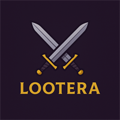
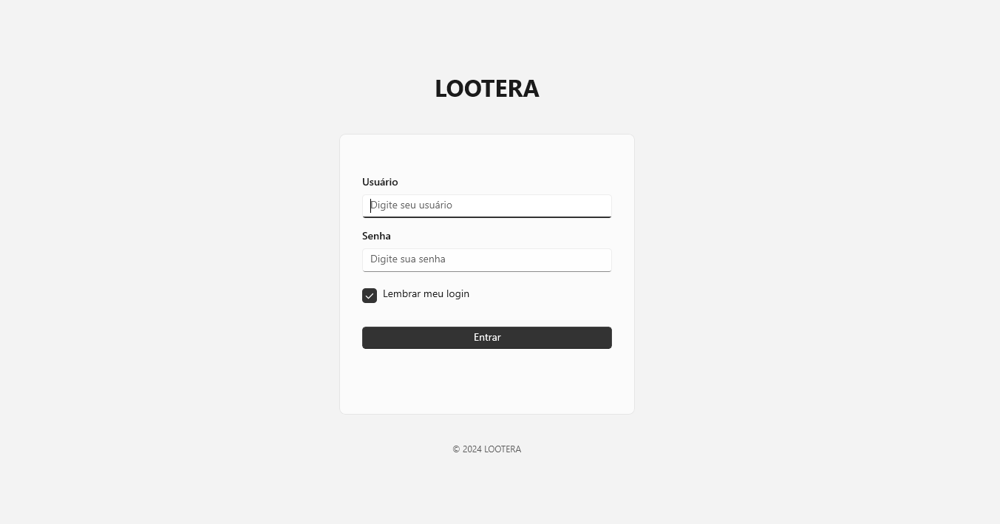
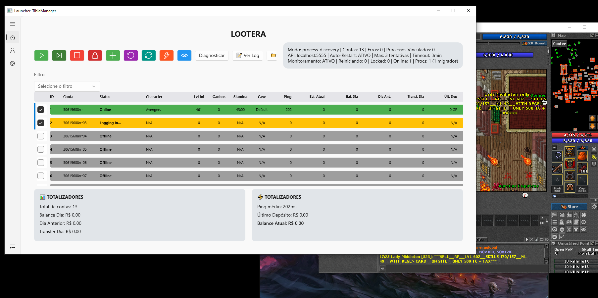
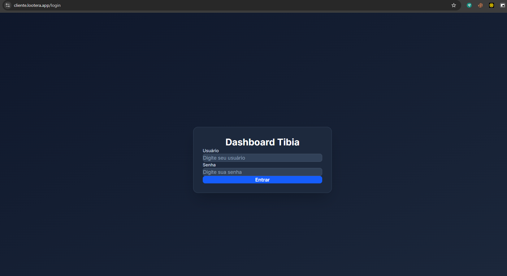

  
  <h1>Tibia Manager - Launcher</h1>

Bem-vindo ao **Tibia Manager**, sua ferramenta completa para gerenciar múltiplas contas de Tibia de forma prática e eficiente.

---

## O que é o Tibia Manager?

O Tibia Manager é uma aplicação desktop desenvolvida para jogadores de Tibia que desejam:

- ✓ Gerenciar múltiplas contas de forma centralizada
- ✓ Monitorar personagens em tempo real
- ✓ Acompanhar experiência, stamina e progresso
- ✓ Acessar informações de saldo e localização de caves
- ✓ Organizar suas contas com facilidade
- ✓ Sincronizar dados automaticamente

---

## Como Usar

### 1. Instalação

Faça o download da aplicação e extraia o zip.

### 2. Login

Ao abrir a aplicação pela primeira vez, você será solicitado a fazer login com suas credenciais de acesso.

### 3. Dashboard Principal

Após o login, você terá acesso ao seu dashboard com todos os seus personagens listados.

### 4. Monitoramento Online

Quando seus personagens estão online, o dashboard é atualizado em tempo real com informações sobre:

- **Nível** do personagem
- **Experiência** acumulada
- **Stamina** disponível
- **Saldo** em ouro
- **Localização** na cave
- **Ping** de conexão

---

## Funcionalidades Principais

### Gerenciamento de Contas

- Adicione novas contas à aplicação
- Edite informações de contas existentes
- Remova contas que não usa mais
- Importe múltiplas contas em lote

### Dashboard

- Visualize todos os seus personagens em um único lugar
- Acompanhe o status online/offline em tempo real
- Monitore estatísticas de cada personagem
- Filtre personagens por status

### Configurações

- Customize as preferências da aplicação
- Ajuste opções de sincronização
- Gerencie seus dados de forma segura

---

## Dicas e Boas Práticas

1. **Mantenha a aplicação aberta** para sincronização contínua com seus dados
2. **Atualize frequentemente** para obter as melhores melhorias
3. **Guarde suas credenciais** de forma segura
4. **Sincronize seus dados** regularmente para não perder informações

---

## Suporte

Caso encontre problemas ou tenha dúvidas:

- Verifique se está usando a versão mais recente
- Tente reiniciar a aplicação
- Verifique sua conexão com a internet
- Entre em contato com o suporte

---

## Versão

**Tibia Manager v0.1.4**

---

Aproveite ao máximo sua experiência em Tibia com o Tibia Manager!
